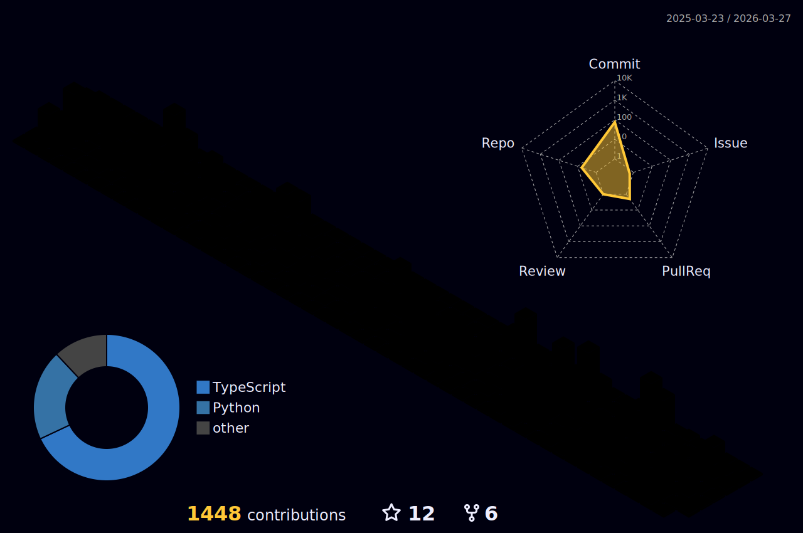

  <ul>
    <li>Pursuing a bachelor's degree in computer science.</li>
    <li>I'm studying JavaScript and NeetCode right now.</li>
    <li>Enjoys building cool and unhinged stuff.</li>
  </ul>

## 🌐 Socials:
  

# 💻 Tech Stack:
             

# 📊 GitHub Stats:
 
 

  

## 🏆 GitHub Trophies

  

### ✍️ Random Dev Quote

  
